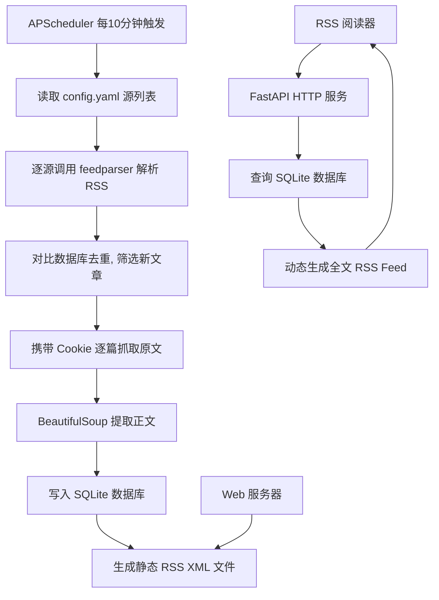
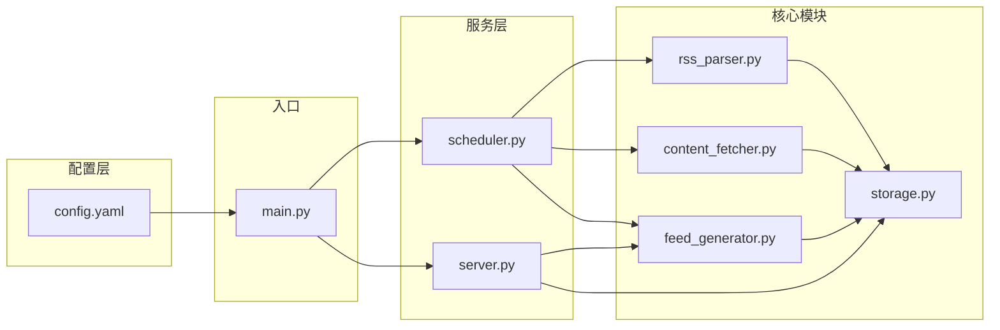

## Product Overview

一个 RSS 全文输出中转服务。订阅多个 RSS 源，定时自动拉取文章列表，抓取每篇文章的原文全文内容，存储到本地 SQLite 数据库，并以新的 RSS Feed（包含全文）对外提供服务，供 RSS 阅读器直接订阅。

## Core Features

- **多源 RSS 订阅管理**：通过配置文件管理多个 RSS 源，每个源可配置名称、URL、Cookie 文件路径、正文 CSS 选择器等参数
- **定时自动抓取**：每 10 分钟自动拉取所有已配置的 RSS 源，解析文章列表，基于链接去重，仅抓取新文章
- **原文全文抓取**：对每篇新文章，携带 Cookie 访问详情页，使用配置的 CSS 选择器提取正文 HTML 内容；支持请求间随机延迟防封、检测登录失效并记录日志
- **SQLite 本地存储**：将文章的标题、链接、摘要、全文内容、发布时间、抓取时间、所属源等信息持久化存储，支持按源查询和链接去重
- **HTTP Feed 服务**：启动本地 HTTP 服务，为每个 RSS 源提供独立的全文 RSS Feed 端点（如 `/feed/<source_name>`），也提供聚合所有源的 Feed 端点
- **静态 XML 导出**：每次抓取完成后，同步生成静态 RSS XML 文件到指定目录，可直接部署到任意 Web 服务器

## Tech Stack

| 环节 | 技术选型 | 说明 |
| --- | --- | --- |
| 语言 | Python 3.10+ | 生态丰富，适合爬虫和 Web 服务 |
| RSS 解析 | feedparser | 成熟稳定的 RSS/Atom 解析库 |
| HTTP 请求 | requests + Session | 支持 Cookie 保持和连接复用 |
| HTML 解析 | BeautifulSoup4 + lxml | 高性能 HTML 解析 |
| 数据库 | SQLite3（标准库） | 轻量、零配置、适合单机场景 |
| Web 服务 | FastAPI + uvicorn | 异步高性能，自带 API 文档 |
| RSS 生成 | rfeed 或手动拼接 Jinja2 模板 | 生成标准 RSS 2.0 XML |
| 定时调度 | APScheduler | 支持 interval 触发器，可后台运行 |
| 配置管理 | YAML (PyYAML) | 可读性强，适合多源配置 |


## Implementation Approach

### 整体策略

采用模块化架构，将 RSS 解析、内容抓取、数据存储、Feed 生成、HTTP 服务、定时调度拆分为独立模块。主进程启动后同时运行 APScheduler 定时任务和 FastAPI HTTP 服务，共享同一个 SQLite 数据库。

### 工作流程



### 关键技术决策

1. **FastAPI 而非 Flask**：FastAPI 原生支持异步，与 APScheduler 的后台调度更好配合，且自带 `/docs` 接口文档，方便调试。

2. **SQLite 去重策略**：以 `(source_name, link)` 作为唯一约束，INSERT OR IGNORE 实现幂等写入，避免重复抓取。

3. **多源 CSS 选择器配置**：每个 RSS 源在 config.yaml 中独立配置 `content_selector`，支持不同网站的正文提取规则。对于无需登录的源可不配置 cookie_file。

4. **静态 XML + 动态 HTTP 双模式**：静态 XML 在每次抓取后即时生成，适合 Nginx 直接托管；HTTP 端点实时查询数据库生成，保证最新性。

5. **Feed 生成使用 Jinja2 模板**：手动拼接 RSS 2.0 XML 比依赖 rfeed 库更灵活可控，且减少外部依赖。使用 Jinja2 模板渲染 XML，保证格式正确和可维护性。

6. **防封策略**：requests Session 复用连接、随机 User-Agent、请求间 1-3 秒随机延迟、检测 302 重定向判断 Cookie 失效。

## Implementation Notes

- **并发控制**：SQLite 在多线程写入时可能冲突，使用 `check_same_thread=False` + 线程锁保护写操作；APScheduler 使用 `max_instances=1` 防止任务重叠
- **Feed 条目数量**：每个 Feed 默认输出最近 50 篇文章，可在配置中调整
- **Cookie 失效检测**：抓取时检测 HTTP 302 重定向或页面中包含登录表单关键字，日志记录 WARNING 级别提示
- **优雅降级**：如果原文抓取失败（网络异常、Cookie 失效），仍保存 RSS 中的摘要内容，标记 `full_content_fetched=False`，后续可重试
- **日志系统**：使用 Python logging 模块，INFO 级别记录抓取进度，WARNING 记录 Cookie 失效，ERROR 记录异常，日志输出到控制台和文件
- **启动方式**：单进程启动，APScheduler 以后台线程运行定时任务，主线程运行 uvicorn 服务 FastAPI

## Architecture Design

### 模块关系



### 数据模型

articles 表结构：

- `id` INTEGER PRIMARY KEY
- `source_name` TEXT NOT NULL — 所属源名称
- `title` TEXT NOT NULL — 文章标题
- `link` TEXT NOT NULL — 原文链接
- `summary` TEXT — RSS 摘要
- `content` TEXT — 全文 HTML 内容
- `full_content_fetched` BOOLEAN DEFAULT FALSE — 是否成功抓取全文
- `author` TEXT — 作者
- `published_at` DATETIME — 发布时间
- `created_at` DATETIME DEFAULT CURRENT_TIMESTAMP — 入库时间
- UNIQUE(source_name, link) — 去重约束

## Directory Structure

```
RssCrawler/
├── main.py              # [NEW] 主入口。解析命令行参数，加载配置，启动 APScheduler 定时任务和 FastAPI HTTP 服务。支持 --config 指定配置文件路径，--port 指定服务端口
├── config.yaml          # [NEW] 多源配置文件。定义全局参数（更新频率、输出目录、日志级别、Feed 条目数）和各 RSS 源的独立配置（名称、URL、cookie_file、content_selector、需要登录标记）
├── rss_parser.py        # [NEW] RSS 解析模块。使用 feedparser 解析 RSS/Atom 源，提取文章列表（标题、链接、摘要、作者、发布时间），返回标准化的文章字典列表
├── content_fetcher.py   # [NEW] 原文抓取模块。使用 requests.Session 携带 Cookie 请求文章详情页，BeautifulSoup 按配置的 CSS 选择器提取正文 HTML。包含随机延迟、User-Agent 轮换、302 重定向检测、重试逻辑
├── storage.py           # [NEW] 数据存储模块。封装 SQLite 操作：初始化表结构、批量插入文章（去重）、按源查询文章列表、更新全文内容、查询未抓取全文的文章、线程安全锁
├── feed_generator.py    # [NEW] Feed 生成模块。使用 Jinja2 模板将数据库中的文章渲染为标准 RSS 2.0 XML。支持按源生成独立 Feed 和聚合所有源的 Feed，支持输出为字符串（HTTP 响应）或写入静态 XML 文件
├── scheduler.py         # [NEW] 定时调度模块。使用 APScheduler IntervalTrigger 每 10 分钟执行一次抓取任务：遍历所有配置的源 → 解析 RSS → 去重入库 → 抓取新文章原文 → 生成静态 XML。包含任务锁防止重叠执行
├── server.py            # [NEW] HTTP 服务模块。FastAPI 应用，提供端点：GET /feeds 列出所有源；GET /feed/{source_name} 返回指定源的全文 RSS XML；GET /feed/all 返回聚合 Feed；GET /status 返回各源抓取状态
├── templates/
│   └── rss_feed.xml     # [NEW] RSS 2.0 XML Jinja2 模板。定义 channel 元素（title、link、description、lastBuildDate）和 item 元素（title、link、description 含全文、pubDate、guid），正确处理 XML 转义
├── output/              # [NEW] 静态 XML 输出目录。存放每次生成的各源独立 Feed XML 文件和聚合 Feed XML 文件，文件名对应源名称
├── logs/                # [NEW] 日志目录。存放运行日志文件
├── cookies/             # [NEW] Cookie 文件目录。存放各源的 Cookie 文本文件
├── requirements.txt     # [NEW] Python 依赖清单：feedparser, requests, beautifulsoup4, lxml, fastapi, uvicorn, apscheduler, pyyaml, jinja2
└── README.md            # [NEW] 项目说明文档。包含功能介绍、安装步骤、配置说明、Cookie 获取方法、使用示例、API 端点说明
```

## Key Code Structures

```
# config.yaml 配置结构示例
global:
  update_interval: 10        # 分钟
  feed_items_limit: 50       # 每个 Feed 输出的最大文章数
  output_dir: "./output"
  log_level: "INFO"
  server_port: 8080

sources:
  - name: "cnblogs-news"
    url: "https://feed.cnblogs.com/news/rss"
    cookie_file: "./cookies/cnblogs.txt"
    content_selector: "#news_content"
    requires_login: true
    
  - name: "example-blog"
    url: "https://example.com/feed.xml"
    cookie_file: null
    content_selector: "article .post-content"
    requires_login: false
```

```python
# storage.py 核心接口
class ArticleStore:
    def __init__(self, db_path: str = "articles.db") -> None: ...
    def init_db(self) -> None: ...
    def insert_articles(self, articles: list[dict]) -> int: ...  # 返回新增数量
    def update_content(self, link: str, source_name: str, content: str) -> None: ...
    def get_articles(self, source_name: str | None, limit: int = 50) -> list[dict]: ...
    def get_unfetched(self, source_name: str) -> list[dict]: ...  # 获取未抓取全文的文章
```

## Agent Extensions

### Skill

- **blogwatcher**
- Purpose: 在开发过程中辅助监控和验证 RSS/Atom 订阅源的更新情况，用于测试验证抓取功能是否正常工作
- Expected outcome: 能够快速检查 RSS 源的可达性和最新内容，辅助调试

### SubAgent

- **code-explorer**
- Purpose: 在实现过程中如果需要参考第三方库（feedparser、APScheduler、FastAPI）的用法或查找项目中的跨文件依赖关系
- Expected outcome: 快速定位代码引用和模块间依赖，确保实现的准确性